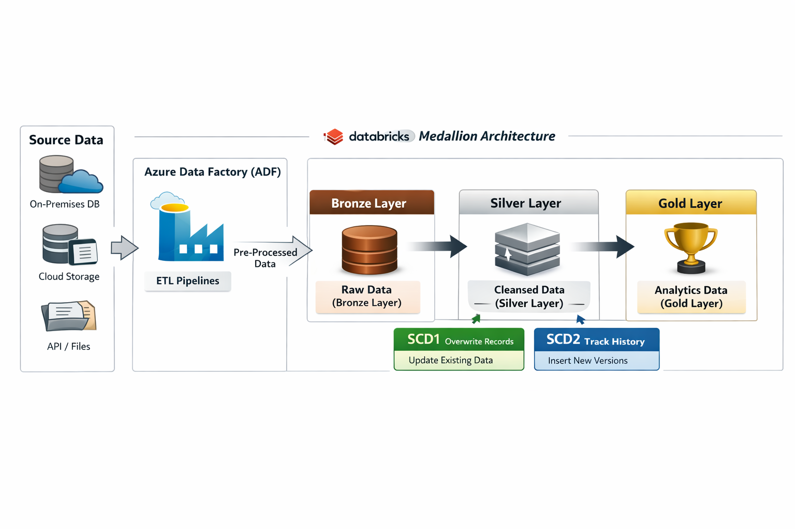

# Azure Data Engineering Project

## Architecture Workflow

📌 Overview

This repository is part of a full-stack Azure Data Engineering project demonstrating end-to-end data ingestion, transformation, and observability using modern Azure services.

The solution combines:

Azure Data Factory (ADF) for ingestion, orchestration, and monitoring

Azure Databricks for scalable transformations using Medallion Architecture (Bronze → Silver → Gold)

Centralized logging & diagnostics for enterprise-grade observability

🏗️ Architecture Workflow
Azure Data Engineering Workflow

The workflow begins with ADF pipelines, followed by Databricks transformations, and is supported by a centralized logging and diagnostic framework.

Source Systems
      │
      ▼
Azure Data Factory (ADF)
  (Ingestion + Logging)
      │
      ▼
Databricks Bronze Layer
      │
      ▼
Databricks Silver Layer (SCD1 / SCD2)
      │
      ▼
Databricks Gold Layer (Reporting / BI)

SCD Logic

SCD Type 1 – Overwrites existing records

SCD Type 2 – Tracks historical changes with versioning

📁 Repository Links

This project is intentionally modular, mirroring real-world enterprise data platforms.

🔹 Azure Data Factory (ADF)

ETL orchestration, ingestion pipelines, datasets, linked services, and triggers
👉 https://github.com/pranavprasanth14/ADF_REPO

🔹 Azure Databricks

SCD1 & SCD2 transformations using Medallion Architecture
👉 https://github.com/pranavprasanth14/ADB_REPO

🔹 ADF Logging & Diagnostic Framework

Centralized error handling, execution logging, and diagnostics
👉 https://github.com/pranavprasanth14/AZURE-LOG-MECHANISM

🚀 Project Overview
Step 1: Azure Data Factory (ADF)

Ingest data from multiple source systems

Perform preliminary transformations and validations

Store curated datasets in landing / staging zones

Orchestrate workflows using triggers and dependencies

Log execution metadata, success, and failures centrally

Step 2: Azure Databricks

Bronze Layer: Ingest pre-processed data from ADF outputs

Silver Layer: Apply SCD1 & SCD2 logic for historical tracking

Gold Layer: Produce analytics-ready datasets for BI and reporting

🛡️ ADF Logging & Observability

To ensure production-grade monitoring, this project integrates a dedicated ADF logging and diagnostics framework implemented as a standalone module.

Key Capabilities

SQL-based execution logging

Job start, success, and failure tracking

Detailed error diagnostics using ADF system variables

Pipeline and activity-level observability

No pipeline execution ends without a log entry

This design cleanly separates:

Data processing logic

Transformation logic

Operational observability

👉 Full implementation:
https://github.com/pranavprasanth14/AZURE-LOG-MECHANISM

📌 How to Use
1️⃣ Clone and Run ADF Pipelines
git clone https://github.com/pranavprasanth14/ADF_REPO.git

Deploy pipelines in Azure Data Factory

Configure linked services and datasets

Trigger pipelines manually or via schedule

2️⃣ Run Databricks Transformations
git clone https://github.com/pranavprasanth14/ADB_REPO.git

Execute Bronze → Silver → Gold notebooks

Apply SCD1 & SCD2 transformations

Generate analytics-ready tables

3️⃣ Enable Logging & Diagnostics

Deploy SQL logging tables and stored procedures

Import logging pipeline from AZURE-LOG-MECHANISM

Monitor executions via SQL logs and diagnostics

🛠️ Technologies Used

Azure Data Factory

Azure Databricks

Apache Spark

Delta Lake

Azure SQL Database

Medallion Architecture

Slowly Changing Dimensions (SCD1 & SCD2)

🎯 Key Highlights (Interview-Ready)

Modular, enterprise-style project design

Production-grade ADF logging and diagnostics

Real-world SCD implementation using Databricks

Clear separation of ingestion, transformation, and observability

Designed with scalability and monitoring in mind

👤 Author

Pranav Prasanth
Azure Data Engineer | Azure Data Factory | Databricks

🏷️ Tags

#AzureDataFactory #AzureDatabricks #DataEngineering
#SCD1 #SCD2 #MedallionArchitecture #ADFLogging
